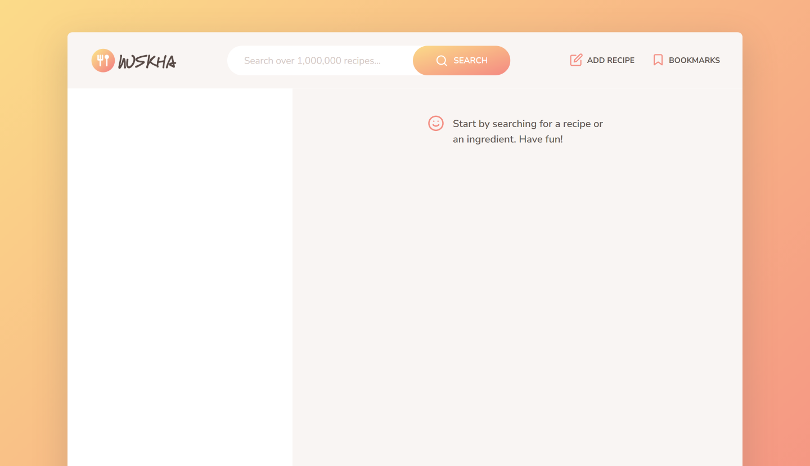

<div id="top"></div>


<!-- PROJECT LOGO -->
<br />
<div align="center">
  <a href="https://nuskha.netlify.app/">
    
  </a>
  <h1 align="center">Nuskha</h1>

  <p align="center">
    <a href="https://nuskha.netlify.app/">View Demo</a>
    ·
    <a href="https://github.com/sarfarazstark/nuskha/issues">Report Bug</a>
  </p>
</div>

<!-- TABLE OF CONTENTS -->
<details>
  <summary>Table of Contents</summary>
  <ol>
    <li>
      <a href="#about-the-project">About The Project</a>
      <ul>
        <li><a href="#features">Features</a></li>
        <li><a href="#built-with">Built With</a></li>
        <li><a href="#flowchart">Flowchart</a></li>
        <li><a href="#architecture">Architecture</a></li>
      </ul>
    </li>
    <li>
      <a href="#getting-started">Getting Started</a>
      <ul>
        <li><a href="#installation">Installation</a></li>
        <li><a href="#tree-structure">Tree Structure</a></li>
      </ul>
    </li>
    <li><a href="#contributing">Contributing</a></li>
    <li><a href="#acknowledgments">Acknowledgments</a></li>
  </ol>
</details>

<!-- ABOUT THE PROJECT -->

## About The Project

Nuskha is a recipe web app using the [Forkify API](https://forkify-api.herokuapp.com/v2) to allow users to search, view, modify, bookmark and add recipes.

- Available search queries : [Queries](https://forkify-api.herokuapp.com/phrases.html)



### Features

| User Stories                                                               | Features                                                                                                                                                                              |
| -------------------------------------------------------------------------- | ------------------------------------------------------------------------------------------------------------------------------------------------------------------------------------- |
| Search for recipes                                                         | <ul><li>functionality: input field to send request to API with searched keywords<li>Display results with pagination<li>Display recipe with cooking time, serving and ingredients</ul> |
| Update the number of servings                                              | <ul><li>Change serving functionality: update all ingredients according ro current number of servings</ul>                                                                             |
| Bookmark recipes                                                           | <ul><li>Bookmarking functionality: display list of all bookmarked recipes</ul>                                                                                                        |
| Create recipes                                                             | <ul><li>Users can upload their own recipes</li><li>User recipes will automatically be bookmarked<li>User can only see their own recipes, not recipes from other users</ul>            |
| Access to bookmarks and recipes when leaving the app and coming back later | <ul><li>Store bookmark data in the browser using "local storage"</ul>                                                                                                                 |

<p align="right">(<a href="#top">back to top</a>)</p>

---

### Built With

- HTML
- CSS
- SASS
- JavaScript
- Parcel
- Babel
- Forkify API
- Libraries
  - fractional

---

### Flowchart


### Architecture


<p align="right">(<a href="#top">back to top</a>)</p>

---

<!-- GETTING STARTED -->

## Getting Started

This project require some prequesites and dependenscies to be installed, you can view it online using this [demo](https://nuskha.netlify.app). or you can find the instructions below

> To get a local copy, follow these simple steps :

### Installation

1. Clone the repo
   ```sh
   git clone https://github.com/sarfarazstark/nuskha.git
   ```
2. Go to project folder

```bash
cd nuskha
```

3. install dependencies

```bash
npm install
```

4. Run start script

```bash
npm start
```

#### Tree structure

```
nuskha
│   .gitignore
│   .prettierrc
│   index.html
│   package-lock.json
│   package.json
│   README.md
│
└───src
    ├───img
    │       favicon.png
    │       nuskha-architecture.png
    │       nuskha-flowchart.png
    │       icons.svg
    │       logo.png
    │       preview.png
    │
    ├───js
    │   │   config.js
    │   │   controller.js
    │   │   helpers.js
    │   │   model.js
    │   │
    │   └───views
    │           addRecipeView.js
    │           bookmarksView.js
    │           paginationView.js
    │           previewView.js
    │           recipeView.js
    │           resultsView.js
    │           searchResultView.js
    │           view.js
    │
    └───sass
            main.scss
            _base.scss
            _components.scss
            _header.scss
            _preview.scss
            _recipe.scss
            _searchResults.scss
            _upload.scss
```

<p align="right">(<a href="#top">back to top</a>)</p>

<!-- ACKNOWLEDGMENTS -->

## Acknowledgments

- [Jonas schmedtmann](https://github.com/jonasschmedtmann)
